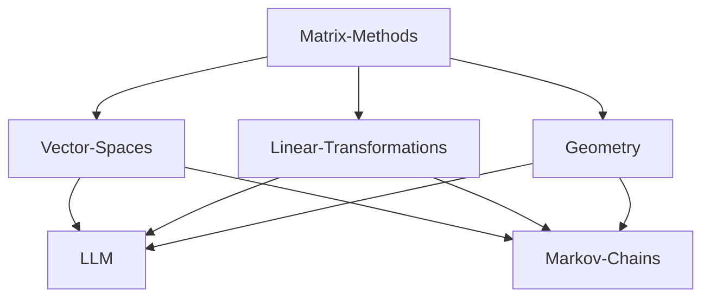

# la-carte
Linear algebra minicourses, a la carte

```mermaid
  graph TD;
      Matrix-Methods --> Vector-Spaces;
      Matrix-Methods --> Linear-Transformations;
	  Matrix-Methods --> Geometry;
	  Vector-Spaces --> LLM;
	  Linear-Transformations --> LLM;
	  Geometry --> LLM;
	  Vector-Spaces --> Markov-Chains;
	  Linear-Transformations --> Markov-Chains;
	  Geometry --> Markov-Chains;
```
