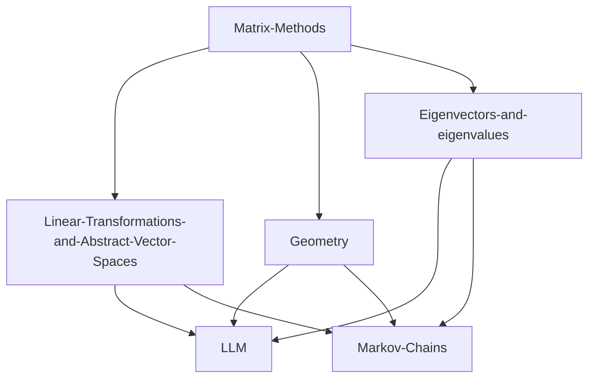

# la-carte
Linear algebra minicourses, a la carte

Perhaps the second row conclucludes with least squares; with Linear-Transformations-and-Abstract-Vector-Spaces taking an essenitally algebraic point of view, Geometry taking a geometric point of view, and Eigenvectors-and-eigenvalues taking a data/stats point of view.

